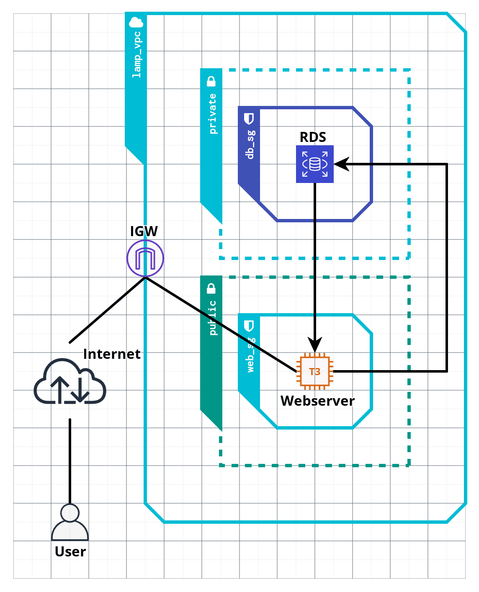

  
  # Project Overview

"One of our core values is focused on not reinventing the wheel. When a high-quality, open source option is available, we tend to gravitate towards that as opposed to rolling our own solution where viable."
  
> https://kion.io/resources/open-source-community

My whole life, I have leveraged tools around me to allow me to go further and go faster. When it comes to writing code, and especially automation, when you don't reinvent the wheel, you can spend more time being creative and solving problems. Code, like Legos, can be used to piece together something unique- all while using what others have already created.

To perform this assessment, I could have found a repository, pulled the code and made some changes to resource names, and no one would question it a bit. In fact, most people that I know copy good code and just modify it. Why wouldn't we? 

In tech, we need to move fast and solve problems. The best problem solvers learn the power of leverage and use it in almost every aspect of their day. Why? Because it allows people to go further and faster. 

Knowing that other applicants before me have taken such tests for Kion in the past, I used Google to find anything cloutamer and terraform related in Github. I came across John G. Fisher's repo: 
https://github.com/jg-fisher/Terraform-Azure-LAMP

In the real world, I wouldn't ever start from scratch. I would simply fork John's repo, give him credit, submit the code and call it a day...and to be honest I almost did. 

BUT...since this exercise is about testing my skills, I did the work. I didn't write it blindfolded, and I didn't write it from scratch...I pulled snippets of code together, made changes, and created this repo. Here are some of the resources that I used:

[https://github.com/deadlysyn/terraform-lamp-aws](https://github.com/deadlysyn/terraform-lamp-aws)

[https://github.com/hashicorp/learn-terraform-sensitive-variables](https://github.com/hashicorp/learn-terraform-sensitive-variables)

[https://gitlab.com/aaurin/lamp](https://gitlab.com/aaurin/lamp)

[https://dev.to/rajitpaul/multi-tier-architecture-on-aws-vpc-ec2-rds-using-terraform-52bj](https://dev.to/rajitpaul/multi-tier-architecture-on-aws-vpc-ec2-rds-using-terraform-52bj)

[https://docs.aws.amazon.com/AWSEC2/latest/UserGuide/ec2-lamp-amazon-linux-2.html](https://docs.aws.amazon.com/AWSEC2/latest/UserGuide/ec2-lamp-amazon-linux-2.html)

[https://docs.aws.amazon.com/AWSEC2/latest/UserGuide/user-data.html](https://docs.aws.amazon.com/AWSEC2/latest/UserGuide/user-data.html)

[https://learn.hashicorp.com/tutorials/terraform/cloud-init?in=terraform/provision](https://learn.hashicorp.com/tutorials/terraform/cloud-init?in=terraform/provision)

[https://stackoverflow.com/questions/49743220/how-do-i-create-an-ssh-key-in-terraform/49792833#49792833](https://stackoverflow.com/questions/49743220/how-do-i-create-an-ssh-key-in-terraform/49792833#49792833)

Re-inventing the wheel takes time and destroys productivity. I don't need to know everything about everything, I just need to know how to access information and use leverage. 

On to the good stuff now...

# Launch a LAMP Stack in AWS Using Terraform

### Usage Instructions

1.  Clone this repo
2.  Install Terraform [https://www.terraform.io/downloads](https://www.terraform.io/downloads)
3.  cd into the repo directory  `cd <repository-name>` (Linux)
4.  Run:  `terraform init` (Linux)
5.  Run:  `terraform plan` (Linux)
6.  Run:  `terraform apply -auto-approve` (Linux)
7.  The webserver public DNS name will be output
8.  Visit http://\<webserver public DNS name>

